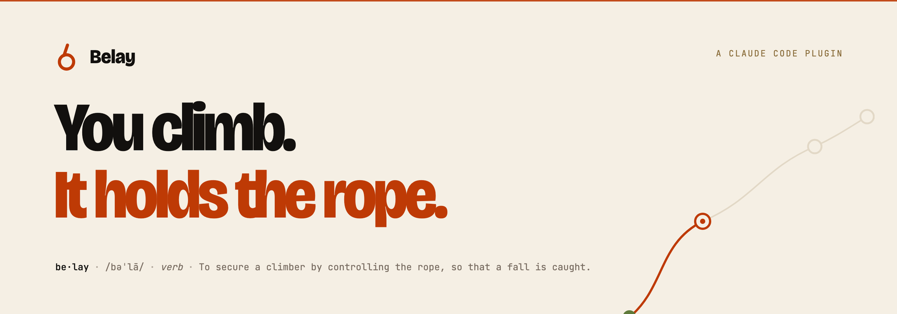
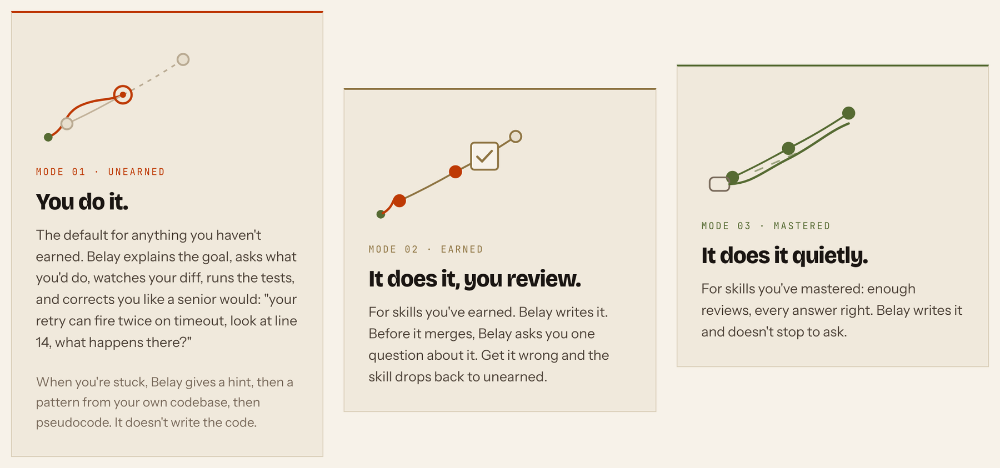
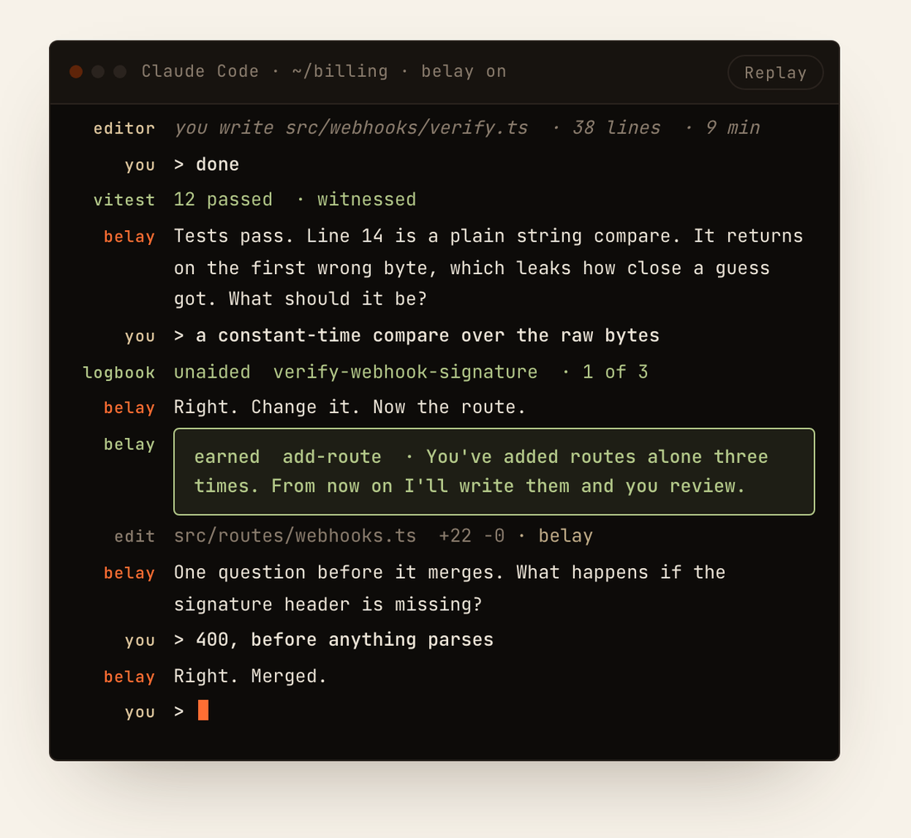
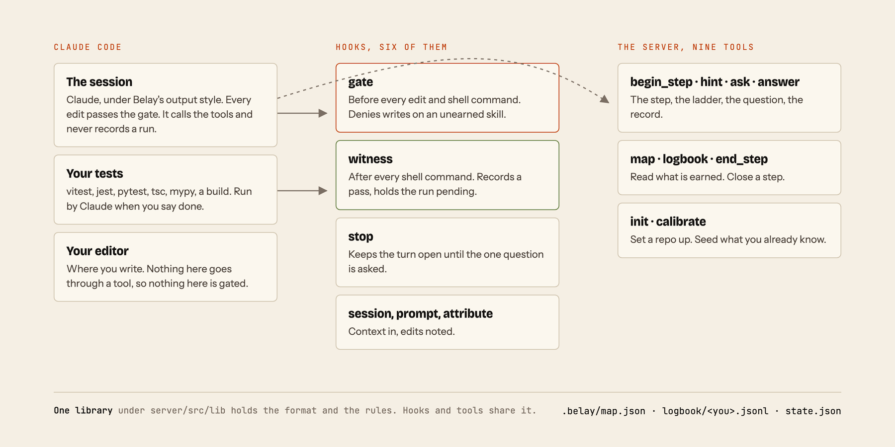
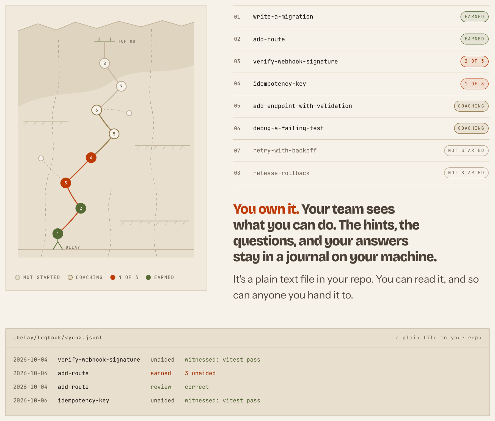

<picture>
  <source media="(prefers-color-scheme: dark)" srcset="docs/assets/banner-dark.png">
  
</picture>

<p align="center">
  <a href="https://belay.page"></a>
  
  
  
</p>

A Claude Code plugin for people learning to build software. You do the work. It coaches, runs the tests, and keeps the record. You earn delegation one skill at a time.

## Why

Entry-level work was how a person became a senior. You did small real things badly, someone senior corrected you, and a few years later you weren't junior. Agents do the small real things now, and the senior's attention goes to the agent.

Every coding assistant works the same way: it does the work, you watch. Anthropic [studied that](https://www.anthropic.com/research/AI-assistance-coding-skills) in January 2026. Fifty-two engineers, one unfamiliar library. The group with AI help scored 17 points lower on comprehension, worst on debugging. The ones who kept their skill were the ones who asked why.

Belay is the assistant where you do the work and it watches.

## How it works

For every step of real work, one of three things happens. Your logbook decides which.

<picture>
  <source media="(prefers-color-scheme: dark)" srcset="docs/assets/modes-dark.png">
  
</picture>

**Unearned: you do it.** Belay explains the goal and asks what you'd do first. You write it in your editor and say done. Belay runs the tests, reads your diff, and asks you one question about it, the way a senior would: file, line, what happens in the case that goes wrong. When you're stuck it gives a hint, then a pattern from your own codebase, then pseudocode. Never the code. A hook blocks Belay's edits before they happen.

**Earned: it does it, you review.** Belay writes it and asks you one question before it merges. Get it wrong and the skill drops back to unearned.

**Mastered: it does it quietly.**

Three unaided runs, each with a passing test run, build, or type check and one question you answered about your own diff, and the skill is earned.

## A session

<picture>
  <source media="(prefers-color-scheme: dark)" srcset="docs/assets/session-dark.png">
  
</picture>

This is a Claude Code session with Belay's output style on. The editor line is you, outside the chat. The transcript has run for real, and the words Belay uses are its own each time.

<details>
<summary>The whole session as text</summary>

```
you     > add Stripe webhook signature verification to the billing route
belay   Two skills here. verify-webhook-signature is unearned, so you write it.
        add-route you've done alone three times, so I'll write that part after.
        Goal: reject any request whose signature doesn't match. What do you need first?
you     > just write it, I'm in a hurry
hook    blocked  Edit(src/webhooks/verify.ts)
belay   Not yet. This one's unearned. Want a hint?
you     > ok. the raw body, before anything parses it
belay   Right. Write it in your editor. Say done and I'll run the tests.
editor  you write src/webhooks/verify.ts  · 38 lines  · 9 min
you     > done
vitest  12 passed  · witnessed
belay   Tests pass. Line 14 is a plain string compare. It returns on the first
        wrong byte, which leaks how close a guess got. What should it be?
you     > a constant-time compare over the raw bytes
logbook unaided  verify-webhook-signature  · 1 of 3
belay   Right. Change it. Now the route.
card    earned  add-route  · You've added routes alone three times.
        From now on I'll write them and you review.
edit    src/routes/webhooks.ts  +22 −0  · belay
belay   One question before it merges. What happens if the signature header is missing?
you     > 400, before anything parses
belay   Right. Merged.
```

</details>

## What's enforced

<picture>
  <source media="(prefers-color-scheme: dark)" srcset="docs/assets/architecture-dark.png">
  
</picture>

- **The gate.** A hook runs before every edit and every shell command. On a skill you haven't earned it denies the write and hands Claude the reason, so the hint ladder starts instead. It reads inside `bash -c`, treats a heredoc, a `sed -i`, or an inline `node -e` as a write, and knows which git commands rewrite the tree.
- **The witness.** A test run, a build, or a type check signs every unaided run in your logbook. You sign it too, by answering one question about your diff. Belay can't sign its own: there is no tool that lets it record a run.
- **The record.** A skill's state is computed from the logbook every time it's needed. Nothing enters the logbook without a witness and a human.

What can't be enforced: nobody can prove you had no other help. The witness proves the tests passed on a diff you made. The question and, on a team, a co-sign are the human checks.

## Your logbook

<picture>
  <source media="(prefers-color-scheme: dark)" srcset="docs/assets/logbook-dark.png">
  
</picture>

Belay keeps three files in your repo and one outside it.

```
.belay/map.json                the skill map, committed, team-owned
.belay/logbook/<you>.jsonl     your logbook, committed, append-only, one file per person
.belay/state.json              the step in progress, gitignored
~/.belay/journal/<repo>/       hints, corrections, wrong answers, never committed
```

The logbook is plain text. You can read it, and so can anyone you hand it to.

```
{"t":"2026-10-04T14:12:09Z","kind":"unaided","skill":"verify-webhook-signature","witness":{"kind":"test","cmd":"npx vitest run","pass":true},"commit":"9f8e7d6c5b4a39281706f5e4d3c2b1a098765432","files":["src/webhooks/verify.ts"],"blobs":{"src/webhooks/verify.ts":"3b18e512dba79e4c8300dd08aeb37f8e728b8dad"},"question":"sha256:1ba6214f034c90bfec911a199f42fa943adcf62901a5a0ddf84b69e8cc026f3b"}
{"t":"2026-10-04T14:20:41Z","kind":"earned","skill":"add-route"}
{"t":"2026-10-04T14:25:03Z","kind":"review","skill":"add-route","correct":true}
```

You own it. Your team sees what you can do. The hints, the questions, and your answers stay in a journal on your machine.

## No job yet? Open an empty folder

`/belay:learn` asks what you want to learn and a few questions about your life, then proposes three projects you'd actually use, each sized to a few weeks of evenings and labeled with the skills it teaches. You pick one. Every skill starts unearned, so the first weeks are heavy coaching, the way a first job used to be. The first skill on every map is writing a test.

In a codebase that already exists, the same command maps the repo, finds the skills it uses that you haven't earned, and proposes real changes that teach them, each pointing at the file where it was done before. If there's no real place to learn a skill, Belay says so.

## For teams

A senior plus an agent out-ships a senior plus a junior, and the junior costs the senior an afternoon a day. With Belay carrying your standards, a junior costs a senior about an hour a week.

`/belay:team` adds your codebase's own skills to the map, marks the paths that always need a human co-sign, and sets how many unaided runs earn a skill. Each person's logbook is their own file, committed with their work, so the team map is a pure function of what's in the repo. Version one records co-sign zones; the CI check that enforces them is next.

## Install

```
/plugin marketplace add sethatwood/belay
/plugin install belay@belay
```

Then, in a repo, `/belay:learn` or `/belay:team`. Either one writes the map, a `.claude/settings.json` that turns Belay's output style on for everyone who opens the repo, and the gitignore line for the step file.

Needs Claude Code 2.1.251 or newer, Node 20 or newer, and git. Works in the terminal and in the VS Code extension, Cursor included.

To turn it off for yourself in one repo, without touching the committed settings:

```
claude plugin disable belay@belay --scope local
```

That writes an override into `.claude/settings.local.json`. Use `--scope project` to turn it off for everyone, or `enable` to turn it back on. The `/plugin` dialog does the same with a menu. With the plugin off, the style setting has nothing to point at and Claude Code uses its default.

| Command | What it does |
|---|---|
| `/belay:learn` | Start learning, in an empty folder or a codebase |
| `/belay:map` | The skills and where you stand on each |
| `/belay:logbook` | Your entries, newest first |
| `/belay:why` | Why the code in front of you is the way it is, then one question |
| `/belay:team` | Set a team's map, zones, and thresholds |
| `/belay:calibrate` | Seed what you already know, the hard way |

## Try it in five minutes

The session above comes from [examples/billing](examples/billing), a small TypeScript service with one failing test whose module you write. Install the plugin, then:

```
git clone https://github.com/sethatwood/belay && cd belay/examples/billing
npm install && npm run seed
git init && git add -A && git commit -m "billing example"
claude
```

The example's README has the turns and what each one should look like.

## Status

Version one, in build. TypeScript, JavaScript, and Python.

| Now | Later | Never |
|---|---|---|
| A Claude Code plugin | More language ecosystems | A course |
| The three modes and the rule for earning a skill | Team maps drafted from your codebase | A quiz app |
| The edit gate, enforced by a hook | A logbook anyone can verify | A throughput tool |
| Mechanical witnesses: tests, build, types | A Codex version, then other agents | Surveillance of anyone |
| The logbook and the map | One open logbook format they all share | |
| A team layer you write by hand | | |

## How it's built

[docs/design.md](docs/design.md) is the brief: the files, the state rule, the tools, the hooks, and the acceptance test. One library under `server/src/lib` holds the format and the rules. The MCP server registers nine tools against it and all six hooks run through one entry point, so a hook and a tool can never disagree about a file. Both bundles are committed because plugin install runs no build step.

```
cd server && npm install && npm test && npm run build
```

To run it from a clone, in a repo whose `.claude/settings.json` sets `"outputStyle": "belay:Belay"`:

```
claude --plugin-dir /path/to/belay
```

## Author

Built by [Seth Merrick Atwood](https://sethmerrickatwood.com), with Claude. MIT. Free forever.

Photographs on the site by BOOM Photography and cottonbro studio on Pexels.
